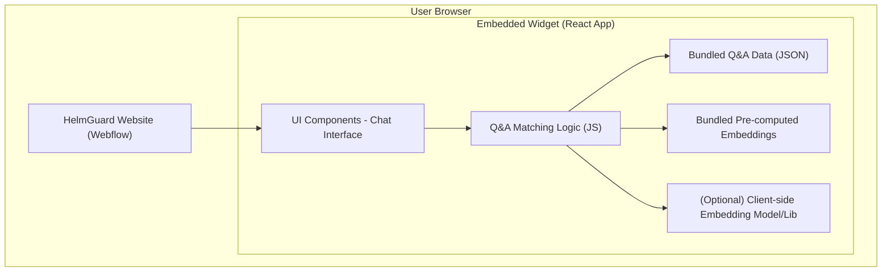

# Product Requirements Document: HelmGuard Demo Widget

<!-- Purpose: This document outlines the requirements for the HelmGuard Demo Widget, a product-led growth initiative. -->

**1. Introduction**

*   **Product:** HelmGuard Demo Widget
*   **Purpose:** To provide a low-friction, interactive demonstration of HelmGuard's core capability: automating responses to cybersecurity due diligence questionnaires. The widget will be embedded on the HelmGuard website.
*   **Goals:**
    *   Increase user engagement on the website.
    *   Generate qualified leads by showcasing immediate value.
    *   Reduce friction in understanding HelmGuard's offering.
    *   Provide a tangible experience of the product's benefits.
*   **Success Metrics (to consider for future iterations):**
    *   Number of widget interactions.
    *   Completion rate (user gets an answer).
    *   Leads generated (e.g., clicks on "Contact Us" after interaction).
    *   Feedback scores (if a feedback mechanism is implemented).

**2. Target Audience**

*   Prospective customers visiting the HelmGuard website, particularly those from:
    *   Financial services sector.
    *   Healthcare sector.
*   Any individual or company responsible for completing or managing cybersecurity questionnaires.
*   Users looking for solutions to automate and streamline the questionnaire process.

**3. Product Overview & Scope**

*   **Overview:** The HelmGuard Demo Widget is an embeddable web component that allows users to input a question from a typical cybersecurity questionnaire and receive an automated answer. It will simulate how HelmGuard uses existing documentation to respond to such queries.
*   **MVP Scope:**
    *   A simple chat-like interface.
    *   Users can type a question.
    *   The widget will attempt to match this question to a predefined set of questions and answers derived from the `Questionnaire_export.csv` (which contains 25 Q&A pairs).
    *   If a relevant answer is found, it's displayed.
    *   If no relevant answer is found (or confidence is low), the widget will provide a message recommending the user speak with the HelmGuard team directly for more complex queries or to learn more.
    *   The widget's UI will be inspired by the existing HelmGuard platform's aesthetic (clean, professional, using HelmGuard branding).
    *   The widget will be built as a standalone React application, designed for easy embedding into a Webflow website (e.g., via an iframe or a script tag that injects the widget).
*   **Future Scope (Post-MVP):**
    *   Ability for users to upload their own documents (PDF, Word, Excel) to be used as a knowledge base.
    *   Support for uploading existing questionnaires in various formats.
    *   More advanced LLM integration for dynamic answer generation based on uploaded content and a larger question bank.
    *   Option to export or save the generated answers.
    *   Analytics for tracking usage patterns and popular questions.
    *   Mechanisms for cost management and preventing abuse for the public-facing tool.

**4. Features and Functionality (MVP)**

*   **F1: User Question Input:**
    *   A text input field where users can type their cybersecurity-related question.
*   **F2: Question Processing & Answer Retrieval (MVP Focus):**
    *   The system will take the user's input question.
    *   It will compare this question against the "Question" column in the `Questionnaire_export.csv`.
    *   **Matching Logic:**
        *   An LLM or a simpler semantic similarity approach (e.g., sentence embeddings with cosine similarity) will be used to find the best match.
        *   A confidence threshold will determine if a match is good enough.
    *   If a high-confidence match is found, the corresponding "Answer" from the `Questionnaire_export.csv` is displayed to the user.
*   **F3: Fallback Mechanism:**
    *   If no high-confidence match is found, the widget will display a pre-defined message.
    *   Example: "I can help with common questions from our sample set. For your specific query, or to see how HelmGuard handles extensive questionnaires and your own documents, please [Contact Us/Book a Demo link]."
*   **F4: Styling and UI:**
    *   The widget will have a clean, intuitive interface.
    *   Visual design (colors, fonts, layout) will align with the HelmGuard branding seen in the provided screenshot (e.g., dark/light themes, use of accent colors like green for positive status).
    *   It should feel like a natural extension of the HelmGuard website.
*   **F5: Embeddability:**
    *   The widget will be delivered as a self-contained JavaScript bundle (from a React app) that can be embedded with minimal code (e.g., a script tag and a placeholder div, or iframe).

**5. LLM Algorithm & Data (MVP)**

*   **Knowledge Base:** The `Questionnaire_export.csv` file, which contains pairs of questions and pre-defined answers.
*   **Approach for MVP (Option A: Sentence Embeddings):**
    1.  **Data Loading:** The Q&A pairs from `Questionnaire_export.csv` will be loaded into the widget (e.g., as a JSON object).
    2.  **Query Understanding & Matching:**
        *   Pre-compute embeddings for all questions in `Questionnaire_export.csv` (can be done offline and bundled).
        *   When a user submits a query, generate an embedding for their query client-side.
        *   Calculate cosine similarity between the user's query embedding and all pre-computed question embeddings.
        *   Select the question with the highest similarity score. If this score is above a defined threshold (e.g., 0.75-0.8), use its corresponding answer.
    3.  **Response Generation:** Display the pre-written answer corresponding to the matched question.

```mermaid
graph LR
    A[User Enters Query] --> B[Widget Frontend (React)]
    B --> C[Sentence Embedding Generation (Client-side)]
    C --> D[Compare with Pre-computed Question Embeddings]
    E[Pre-loaded Q&A Data (from CSV/JSON)] --> D
    D -- Matched Question & Score --> B
    B -- If Score > Threshold --> F[Display Answer]
    B -- Else --> G[Display Fallback Message]
```

**6. Technical Architecture (MVP)**

*   **Frontend:**
    *   **Framework:** React.js.
    *   **Components:**
        *   `WidgetContainer`: Main wrapper, handles overall state and visibility.
        *   `ChatInterface`: Displays conversation, includes `MessageList` and `InputArea`.
        *   `Message`: Renders individual user questions and bot answers.
        *   `InputArea`: Text field for user input and submit button.
    *   **State Management:** React Context API or lightweight state manager (e.g., Zustand, Jotai). Component state and prop drilling may suffice for MVP.
    *   **Logic:**
        *   Handles user input.
        *   Communicates with the Q&A matching logic (client-side JS).
        *   Updates the chat display.
*   **Backend/Data Handling (MVP):**
    *   The `Questionnaire_export.csv` data will be bundled directly into the React application as a JSON file or a JavaScript object.
    *   Sentence embeddings for the CSV questions can be pre-calculated and bundled as well.
    *   **No dedicated database is required for the MVP.**
*   **Communication:**
    *   User interactions happen entirely within the client-side React application.
*   **Deployment (for embedding):**
    *   The React app will be built into static HTML, CSS, and JavaScript files.
    *   These static files can be hosted on a simple static hosting service (e.g., Netlify, Vercel, GitHub Pages).
    *   Embedding via `<script>` tag and a placeholder `<div>`, or `<iframe>`.


    *   **Example Embedding (Conceptual):**
        ```html
        <!-- In Webflow/HelmGuard website HTML: -->
        <div id="helmguard-widget-container"></div>
        <script src="https://path-to-your-widget-bundle.js"></script>
        ```

**7. Input Handling (MVP)**

*   **Primary Input:** Text entered by the user into the widget's input field.
*   **Data Source:** The `Questionnaire_export.csv` file, containing questions and their corresponding pre-written answers. (Likely converted to JSON for ease of use in JavaScript).
*   **Future:** The PRD acknowledges future support for PDF, Word, Excel, but this is out of scope for the MVP.

**8. Cost Analysis & Usage Tracking (Considerations for PRD)**

*   **MVP Cost:**
    *   **Development Time:** Main cost.
    *   **Hosting:** Minimal to none if using free tiers of static hosting services.
    *   **LLM API:** N/A if using client-side sentence embeddings for MVP.
*   **Tracking (for "whether people are using it more than once" - Future):**
    *   For the MVP, this is likely out of scope due to time.
    *   Future: Implement client-side analytics (e.g., Google Analytics) to track widget loads, questions asked, answer success rates, "Contact Us" clicks. Use cookies or local storage for identifying returning users.

**9. Non-Functional Requirements (MVP)**

*   **Performance:** Widget should load quickly and provide responses with minimal delay.
*   **Usability:** Interface must be simple, intuitive, and self-explanatory.
*   **Embeddability:** Solution must be easily integrable into the existing Webflow website.
*   **Responsiveness:** Basic responsiveness for typical desktop screen sizes.
*   **Styling:** Adherence to HelmGuard's visual identity.

**10. Assumptions (MVP)**

*   The `Questionnaire_export.csv` is the sole source of Q&A content for the MVP.
*   The Q&A pairs in the CSV are suitable for direct display.
*   The primary goal is to demonstrate the *concept* of automated answering.
*   A client-side solution for Q&A matching is preferred for MVP.

**11. Future Considerations / Roadmap (Beyond MVP)**

*   Integrate with a more robust backend for larger question banks and user-uploaded documents.
*   Implement advanced LLM techniques for answer generation, summarization, and handling nuanced questions.
*   Develop user authentication if personalized experiences or saved sessions are needed.
*   Introduce more sophisticated analytics and admin dashboards.
*   A/B testing of widget design and functionality.
*   Explore options for rate limiting or other abuse prevention if a backend LLM is used extensively.

--- 